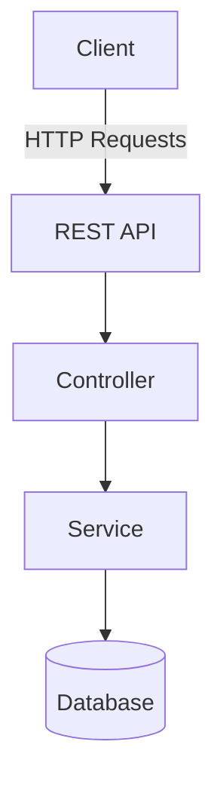
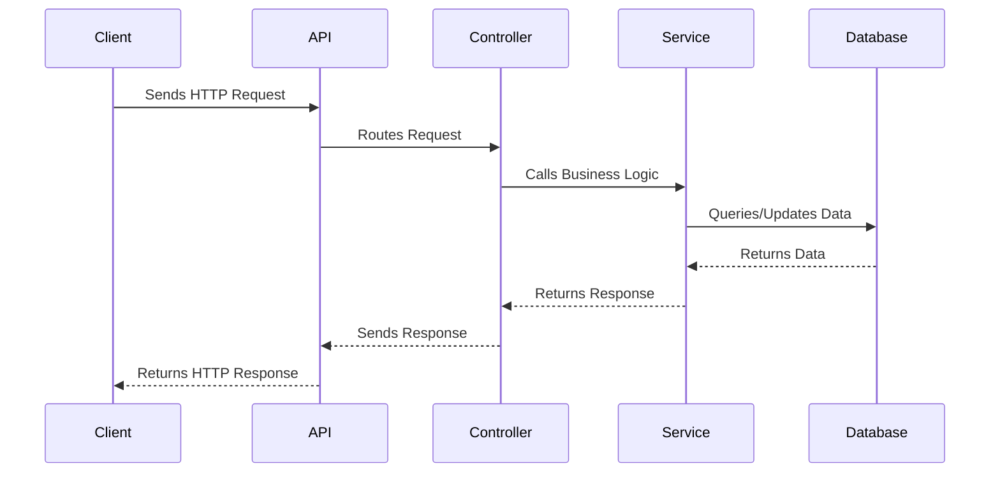

# Sample Node.js Application

This document provides an overview of a sample Node.js application, including its architecture and workflow. It also includes mermaid diagrams for better visualization.

## Application Overview

The sample Node.js application is a RESTful API that allows users to manage tasks. It includes the following features:
- User authentication
- CRUD operations for tasks
- Error handling and logging

## Architecture

The application follows a layered architecture:

### Components
1. **Client**: The front-end or external system interacting with the API.
2. **API**: The RESTful API built using Node.js and Express.
3. **Controller**: Handles incoming requests and sends responses.
4. **Service**: Contains business logic and interacts with the database.
5. **Database**: Stores application data (e.g., MongoDB, PostgreSQL).

## Workflow

The following diagram illustrates the workflow of a typical API request:

## Reference Links

- [Node.js Documentation](https://nodejs.org/en/docs/)
- [Express.js Guide](https://expressjs.com/)
- [Mermaid Documentation](https://mermaid-js.github.io/mermaid/#/)
- [MongoDB Documentation](https://www.mongodb.com/docs/)

## Conclusion

This document provides a high-level overview of the sample Node.js application. Use the reference links for further details on the technologies used.